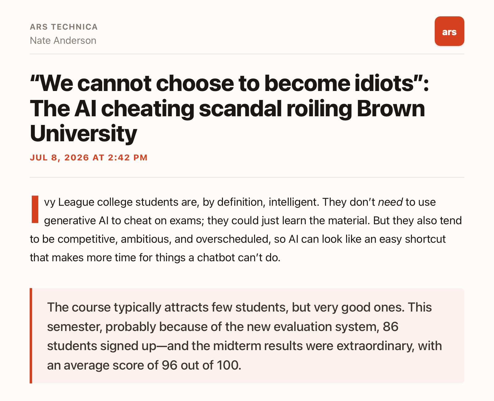
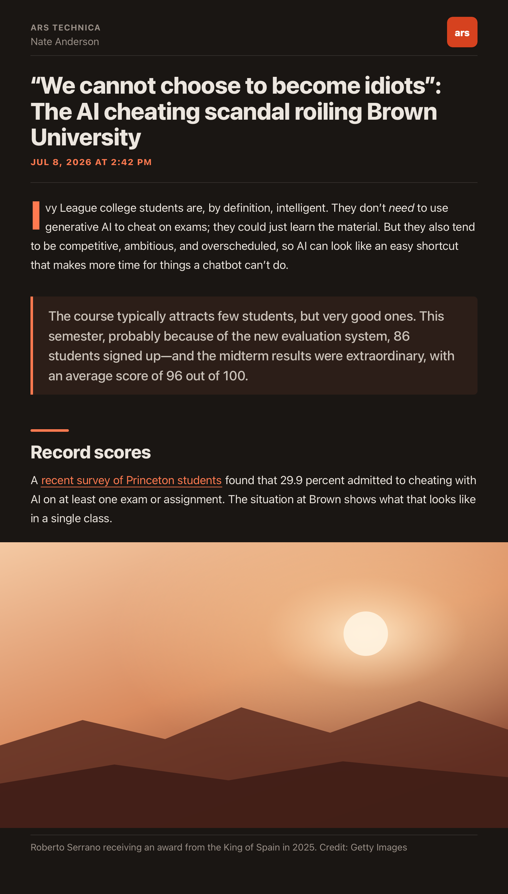

<!-- nnw-theme-identity:start -->
# Ember — a NetNewsWire theme

A warm, editorial theme for [NetNewsWire](https://netnewswire.com) using Apple system
fonts with a vermilion accent, big headline type, a drop cap, flagged section headings,
and full-bleed images. Designed for **macOS, iOS, and iPadOS**, with first-class light
and dark modes.

**→ [ember.marquard.org](https://ember.marquard.org)**

<p align="center">
  
  
</p>

## Install

**One click.** On your Mac, iPhone, or iPad, open **[ember.marquard.org](https://ember.marquard.org)**
and tap **Install in NetNewsWire**. NetNewsWire opens and offers to add Ember.

> The install button uses NetNewsWire's `netnewswire://theme/add` URL scheme. GitHub
> strips custom-scheme links from rendered Markdown, so the working button lives on the
> site rather than in this README.

**Manually.** Download the latest [`Ember.nnwtheme.zip`](https://github.com/dave-atx/ember-nnw-theme/releases/latest):

- **macOS** — unzip and double-click `Ember.nnwtheme`; confirm the install.
- **iOS / iPadOS** — open the `.zip` and share it to NetNewsWire.

Then choose **Ember** as your article theme in NetNewsWire's settings.

## Features

- **Apple system fonts** (SF Pro) throughout — nothing to download, crisp at every size.
- **Warm vermilion accent** that shifts to a lighter coral in dark mode for legibility.
- **Drop cap** on the opening paragraph and a confident headline scale.
- **Flagged section headings** — a short accent bar marks each `<h2>`/`<h3>`.
- **Prominent pull-quotes** with a tinted panel and accent rule.
- **Full-bleed images** that span the column edge-to-edge, captions kept inset.
- **Broader footnote support** with native-style popovers for common Markdown,
  Substack, and WordPress footnote formats.
- **Designed light and dark** — both grounds are warm, not a naive inversion.
- **Platform-tuned** — Dynamic Type on iOS, a larger default size on iPad, and a
  desktop type scale on macOS.

## Requirements

A recent version of NetNewsWire (which supports custom `.nnwtheme` themes) on macOS,
iOS, or iPadOS.

Ember's additional footnote formats require NetNewsWire's **Article JavaScript**
setting, which is enabled by default. If it is disabled, Ember still renders normally,
but only the footnote formats recognized directly by that NetNewsWire version receive
interactive popovers.

## Structure

An `.nnwtheme` bundle is three files. NetNewsWire always loads its own `core.css`
first, then a theme's `stylesheet.css` (which fully replaces the default stylesheet).

```
Ember.nnwtheme/
├── Info.plist       theme name, identifier, author, version
├── template.html    the article scaffold, plus the inline footnote adapter
└── stylesheet.css   the theme (self-contained; replaces the default)
```

The `docs/` folder is the [project site](https://ember.marquard.org) served via GitHub
Pages.

## Developing & testing

Ember uses the tooling from
[netnewswire-theme-template](https://github.com/dave-atx/netnewswire-theme-template):
it renders each article through NetNewsWire's own pipeline (its pinned `core.css`,
page skeletons, and scripts) and checks the result in WebKit, so layout work needs
neither the app nor a NetNewsWire checkout.

**Requirements (macOS):** [`uv`](https://docs.astral.sh/uv/) and
[`playwright-cli`](https://github.com/microsoft/playwright-cli)
(`brew install uv playwright-cli`). Capturing new fixtures from the running app
additionally needs Xcode and a NetNewsWire clone.

```sh
uv run nnw-theme setup      # once: download NetNewsWire's rendering files and WebKit
uv run nnw-theme preview    # live gallery of every fixture; rebuilds on save
uv run nnw-theme check      # release gate: every fixture in WebKit, light and dark
```

Test cases are TOML fixtures in `fixtures/` whose keys mirror the `[[variables]]` in
`template.html`. `uv run nnw-theme capture` explains how to save a real article from
NetNewsWire as a new one. `footnote-providers.toml` declares the note each footnote
format must open, which `check` verifies. Contributor and agent orientation lives in
[`CLAUDE.md`](CLAUDE.md).

To pick up later tooling fixes, commit your work and run `uv run nnw-theme update`.

## Releasing

1. Run `uv run nnw-theme bump` and commit the new `Info.plist` version.
2. In GitHub, run **Actions → Publish theme** with the new tag (for example, `v2.2`).

The workflow checks the theme, refuses a reused tag or a version that did not
increase, attaches `Ember.nnwtheme.zip`, and writes the release notes from the commits
since the last tag with [git-cliff](https://git-cliff.org). The install links always
point at `releases/latest`, so they pick up the newest release automatically.

## License

[Apache License 2.0](LICENSE) © 2026 Dave Marquard.
<!-- nnw-theme-identity:end -->
